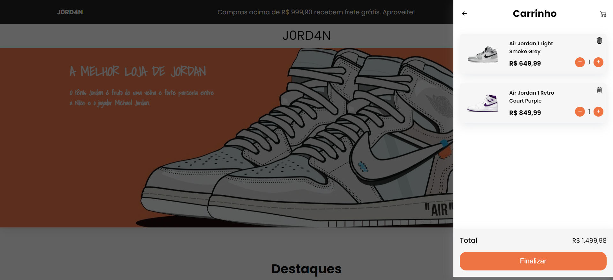

# Landing Page de Sapatos Jordan

Este repositório contém uma landing page responsiva que exibe alguns sapatos Jordan. A página foi criada durante o meu aprendizado de front-end, utilizando HTML, CSS e um pouco de JavaScript.

<a href="https://j0rd4n.netlify.app/">Link para o site</a>

## Projeto

## Carrinho

## Descrição

A landing page de sapatos Jordan é um projeto desenvolvido para praticar e aprimorar as habilidades de front-end. O objetivo do projeto é criar uma página visualmente atraente que mostre alguns modelos de sapatos Jordan.

## Funcionalidades

- Exibição de modelos de sapatos Jordan
- Design responsivo para diferentes dispositivos
- Carrinho de compra

## Tecnologias Utilizadas

- HTML5
- CSS3
- JavaScript

## Como Usar

1. Clone ou faça o download deste repositório para o seu ambiente local.

2. Abra o arquivo `index.html` em um navegador da web.

3. Navegue pela página para visualizar os modelos de sapatos Jordan e suas informações.

4. Interaja com a página, por exemplo, clicando em um sapato para ver detalhes adicionais.

## Contribuindo

Este projeto foi desenvolvido durante o meu aprendizado de front-end e, portanto, não são aceitas contribuições externas neste momento.

## Licença

Este projeto é apenas para fins de aprendizado e não possui uma licença específica.

